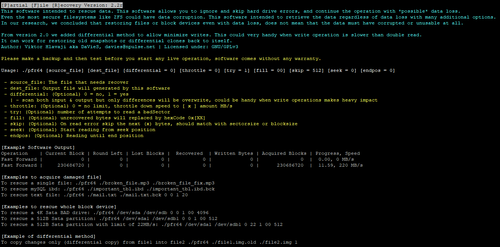

# [P]artial [F]ile [R]ecovery in case of badSector, HDD Error
## Overview
Software is intended to recover, clone files or access data from a bad drive. 
The software is written in pure C.

* Unlike other similar softwares, default action is `Fast Forward` which is a 1MB buffered fast-copy. The software only fallback to `Block Mining` aka `sector-to-sector copy` when and while badblock found.
* In recovery mode, there is an option to define **max retry**, which intended to probe [x] times the same sector to **recover badblock**, there is a little chance to succeed that way on physical hard drives.
Also if the block **could not be recovered** the software **will fill a specified character (default: 0x00)** and continues read, this mechanism allows to **partially recover the data** and covering missing data.

## What can be recover partially
* Block devices such as /dev/sda /dev/da0 and so on..
* innoDB tables (*.ibd) recovery possible on small amount of data loss, combinated with `innodb_recovery_mode = 6` there are a great chance to able to dump the database with only a few rows missing.
* Video Files, Mp3 Files, Pictures, Text Files, Anything like that.

## What can NOT be recover
* Deleted files
* Partitions, the software cannot alter the partition or Disk layout, use `testdisk` software instead

## The story behind it
* I used to solve some dataloss issues in the past and I wanted a tool which is easy to use and understandable.
* ddrescue was too complex and a bit slower.
* I wanted a tool that is native and portable (windows, freebsd, linux)

## Well Proven
* I restored innoDB databases multiple times with `innodb_recovery_mode`
* I cloned many disks with badsectors presents, then I rescued with `testdisk` toolset.
* Simplier and faster than it's competitors, time is important.

## Compilation
* on linux system: `gcc -o pfr64 pfr.c` or for 32bit: `gcc -m32 -o pfr32 pfr.c`
* cross-compile windows: `x86_64-w64-mingw32-gcc -Wl,--stack,4194304 -o pfr64.exe pfr.c -static` or for 32bit: `i686-w64-mingw32-gcc -Wl,--stack,4194304  -o pfr32.exe pfr.c -static`
* freebsd: `clang -o pfr64 pfr.c` or for 32bit: `clang -m32 -o pfr32 pfr.c`

## Usage
````
[P]artial [F]ile [R]ecovery Version: 2.2r
This software intended to rescue data. This software allows you to ignore and skip hard drive errors, and continue the operation with *possible* data loss.
Even the most secure filesystems like ZFS could have data corruption. This software intended to retrieve the data regardless of data loss with many additional options.
In our research, we concluded that restoring files or block devices even with data loss, does not mean that the data must have corrupted or unusable at all.

From version 2.0 we added differential method to allow minimize writes. This could very handy when write operation is slower than double read.
It can work for restoring old snapshots or differential clones back to itself.
Author: Viktor Hlavaji aka DaVieS, davies@npulse.net | Licensed under: GNU/GPLv3

Please make a backup and then test before you start any live operation, software comes without any warranty.

Usage: ./pfr64 [source_file] [dest_file] [differential = 0] [throttle = 0] [try = 1] [fill = 00] [skip = 512] [seek = 0] [endpos = 0]

 - source_file: The file that needs recover
 - dest_file: Output file will generated by this software
 - differential: (Optional) 0 = no, 1 = yes
   | - scan both input & output but only differences will be overwrite, could be handy when write operations makes heavy impact
 - throttle: (Optional) 0 = no limit, throttle down speed to [ x ] amount MB/s
 - try: (Optional) number of attempts to read a badSector
 - fill: (Optional) unrecovered bytes will replaced by hexCode 0x[XX]
 - skip: (Optional) On read error skip the next (x) bytes, should match with sectorsize or blocksize
 - seek: (Optional) Start reading from seek position
 - endpos: (Optional) Reading until end position

[Example Software Output]
Operation    | Current Block | Round Left | Lost Blocks |  Recovered  | Written Bytes | Acquired Blocks | Progress, Speed
Fast Forward |             0 |          0 |           0 |           0 |             0 |              0  |  0.00, 0 MB/s
Fast Forward |     230686720 |          0 |           0 |           0 |             0 |      230686720  |  11.59, 220 MB/s

[Examples to acquire damaged file]
To rescue a single file: ./pfr64 ./broken_file.mp3 ./broken_file_fix.mp3
To rescue mySQL ibd: ./pfr64 ./important_tbl.ibd ./important_tbl.ibd.bck
To rescue text file: ./pfr64 ./mail.txt ./mail.txt.bck 0 0 1 20

[Examples to rescue whole block device]
To rescue a 4K Sata BAD drive: ./pfr64 /dev/sda /dev/sdb 0 0 1 00 4096
To rescue a 512B Sata partition: ./pfr64 /dev/sda1 /dev/sdb1 0 0 1 00 512
To rescue a 512B Sata partition with limit of 22MB/s: ./pfr64 /dev/sda1 /dev/sdb1 0 22 1 00 512

[Example of differential method]
To copy changes only (differential copy) from file1 into file2 ./pfr64 ./file1.img.old ./file2.img 1


````

## Sample Output




## Under License
### GNU/GPLv3


